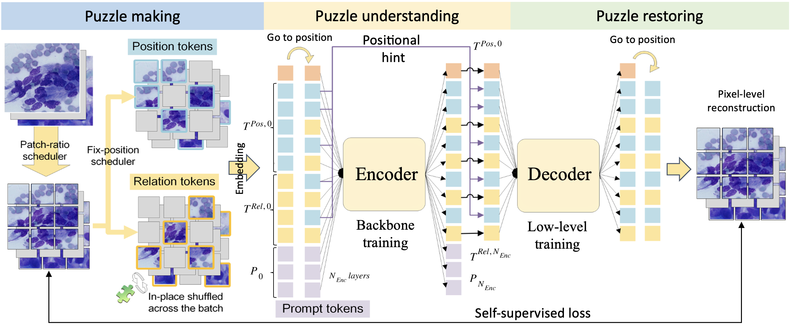
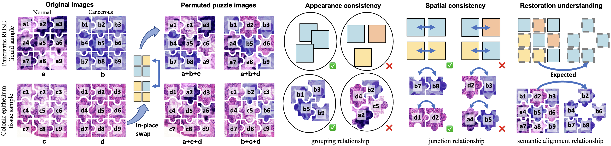
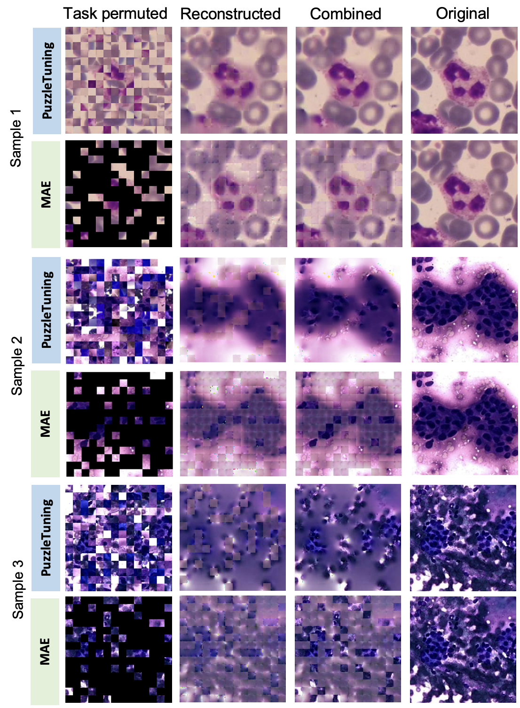

# PuzzleTuning: Bridging Pathological and Natural Image with Puzzles

[[`arXiv`](https://arxiv.org/abs/2311.06712)] [[`Vidio Presentation`](https://www.bilibili.com/video/BV1ZVHje9EdX)]

PuzzleTuning is a large-scale self-supervised pre-training framework designed specifically for pathological image analysis, which explicitly aligns domain knowledge between natural and pathological images by leveraging a novel multi-puzzle restoration task, prompt tuning, and a curriculum learning strategy to enhance representation learning.

## Overview

<div style="text-align: center;">
  
</div>

Three steps are designed in PuzzleTuning: 1) Puzzle making, where image batch are divided into bags of patches and fix-position and relation identity are randomly assigned. The relation patches are then in-place shuffled with each other, making up the puzzle state. 2) Puzzle understanding, where puzzles regarding grouping, junction, and restoration relationships are learned by prompt tokens attached to the encoder. Through the prompt tokens, the pathological focuses are explicitly seamed with general vision knowledge. 3) Puzzle restoring, where the decoder restores the relation patches with position patches as hint, under SSL supervision against original images.

<div style="text-align: center;">
  
</div>

The provided samples highlight key focuses and relationships in pathological image analysis. They include pancreatic liquid samples (a, b) and colonic epithelium tissue samples (c, d), each representing normal (a, c) and cancerous (b, d) conditions. Patches from each image are labeled 1 to 9 and grouped into bags. After intermixing patches across images, the PuzzleTuning framework emphasizes three critical pathological focuses: appearance consistency (visual similarity within tissue types), spatial consistency (structural coherence of patch positions), and restoration understanding (ability to reconstruct original context from shuffled patches).

<div style="text-align: center;">
  
</div>

Illustrations of the permuted (masked by MAE or puzzled by
PuzzleTuning) samples and reconstructed images. The combined image is generated with the visible patches (the unmasked patches or hint patches) replaced by the original patches, illustrating the reconstruction consistency between patches.

## Usage

### Load pretrained PuzzleTuning-VPT model with Huggingface

```Python
from huggingface_hub import hf_hub_download
import torch
from PuzzleTuning.Backbone.GetPromptModel import build_promptmodel

# Define the repo ID
repo_id = "Tianyinus/PuzzleTuning_VPT"

# Download the base state dictionary file
base_state_dict_path = hf_hub_download(repo_id=repo_id, filename="PuzzleTuning/Archive/ViT_b16_224_Imagenet.pth")

# Download the prompt state dictionary file
prompt_state_dict_path = hf_hub_download(repo_id=repo_id,
                                         filename="PuzzleTuning/Archive/ViT_b16_224_timm_PuzzleTuning_SAE_CPIAm_Prompt_Deep_tokennum_20_E_199_promptstate.pth")

# Load these weights into your model
base_state_dict = torch.load(base_state_dict_path)
prompt_state_dict = torch.load(prompt_state_dict_path)

# Build your model using the loaded state dictionaries
model = build_promptmodel(prompt_state_dict=prompt_state_dict,
                          base_state_dict=base_state_dict,
                          num_classes=0)
```

### Prepare pre-trained weights and dataset

The pre-trained weight of PuzzleTuning and all counterparts are available at:

https://drive.google.com/file/d/1-mddejIdCRP5AscnlWAyEcGzfgBIRCSf/view?usp=share_link

We use CPIA dataset for pretraining, the CPIA dataset is available at:

https://github.com/zhanglab2021/CPIA_Dataset

### Training script

```Shell
python -m torch.distributed.launch \
  --nproc_per_node=8 \
  --nnodes=1 \
  --node_rank=0 \
  PuzzleTuning.py \
    --DDP_distributed \
    --batch_size 64 \
    --group_shuffle_size 8 \
    --blr 1.5e-4 \
    --epochs 2000 \
    --accum_iter 2 \
    --print_freq 5000 \
    --check_point_gap 100 \
    --input_size 224 \
    --warmup_epochs 100 \
    --pin_mem \
    --num_workers 32 \
    --strategy loop \
    --PromptTuning Deep \
    --basic_state_dict /home/saved_models/ViT_b16_224_Imagenet.pth \
    --data_path /home/datasets/All

```

## Demo with Colab

For more details, please refer to our colab demo [here](./PuzzleTuning%20Colab%20Demo.ipynb).

## Results

### ROI Classification
The table below reports the average top-5 accuracy and F1-score (%) of PuzzleTuning and state-of-the-art (SOTA) pre-training methods on four downstream classification datasets: CAM16, pRCC, ROSE, and WBC. P-values from paired t-tests validate the statistical significance of performance differences on F1-scores.

| Method              | CAM16 Acc | CAM16 F1 | CAM16 P-val | pRCC Acc | pRCC F1 | pRCC P-val | ROSE Acc | ROSE F1 | ROSE P-val | WBC Acc | WBC F1 | WBC P-val |
|---------------------|-----------|----------|-------------|----------|---------|-------------|----------|---------|-------------|---------|--------|------------|
| SimCLR              | 92.69     | 92.68    | 4.28E-06    | 93.43    | 92.89   | 3.43E-02    | 91.85    | 90.93   | 4.43E-04    | 98.11   | 96.82  | 1.37E-03    |
| MOCO                | 86.30     | 86.21    | 6.72E-03    | 75.55    | 72.43   | 1.95E-06    | 72.28    | 63.84   | 3.02E-09    | 91.37   | 86.40  | 3.98E-06    |
| TransPath (BYOL)    | 91.48     | 91.47    | 1.12E-02    | 75.48    | 72.73   | 1.01E-05    | 92.58    | 91.75   | 1.25E-02    | 95.55   | 92.55  | 1.35E-05    |
| Virchow (DINO)      | 82.50     | 82.29    | 7.25E-05    | 74.20    | 71.28   | 2.21E-06    | 79.76    | 76.02   | 3.89E-06    | 90.79   | 85.45  | 1.81E-05    |
| MAE                 | 93.33     | 93.33    | 1.72E-04    | 93.85    | 93.48   | 1.37E-01    | 91.22    | 90.19   | 9.58E-06    | 97.88   | 96.21  | 3.98E-04    |
| CAE                 | 81.39     | 81.17    | 7.78E-06    | 72.16    | 69.16   | 1.94E-08    | 72.20    | 63.47   | 3.59E-08    | 86.94   | 76.61  | 1.52E-02    |
| GCMAE               | 93.52     | 93.52    | 2.36E-14    | 90.95    | 90.30   | 1.04E-04    | 90.02    | 88.85   | 4.48E-06    | 97.08   | 95.16  | 3.81E-06    |
| MaskFeat            | 94.07     | 94.07    | 4.45E-05    | 92.93    | 92.39   | 1.01E-04    | 90.73    | 89.73   | 1.50E-04    | 97.43   | 95.73  | 5.55E-05    |
| DropPos             | 91.11     | 91.10    | 1.10E-05    | 79.58    | 77.68   | 3.64E-08    | 83.74    | 81.93   | 6.22E-08    | 96.04   | 93.48  | 2.67E-06    |
| JIGSAW              | 88.06     | 88.02    | 2.19E-05    | 73.92    | 70.78   | 2.76E-06    | 73.84    | 65.93   | 1.28E-06    | 92.05   | 87.74  | 8.77E-06    |
| SIMMIM              | 93.52     | 93.52    | 3.56E-04    | 88.62    | 87.62   | 1.58E-06    | 90.53    | 89.39   | 3.43E-06    | 97.03   | 95.03  | 2.14E-05    |
| BeyondMask          | 92.41     | 92.40    | 4.95E-05    | 86.22    | 84.96   | 1.02E-06    | 87.46    | 85.97   | 2.33E-06    | 96.34   | 94.07  | 1.71E-07    |
| **PuzzleTuning**    | **95.83** | **95.83**| **-**       | **93.92**| **93.54**| **-**       | **93.27**| **92.52**| **-**       | **98.49**| **97.36**| **-**       |

### Segmentation (WSSS)
Below is the results of pre-trained weights on the CellViT and CellVPT for WSSS nuclei segmentation, where ViT/VPT denote different backbone models and pt/ft denote updating the prompt tokens or updating all the parameters in downstream training.

| **Initialization** | **ViT+ft DICE** | **ViT+ft Jacard** | **ViT+pt DICE** | **ViT+pt Jacard** | **VPT+ft DICE** | **VPT+ft Jacard** | **VPT+pt DICE** | **VPT+pt Jacard** |
|--------------------|-----------------|-------------------|-----------------|-------------------|------------------|--------------------|------------------|--------------------|
| SimCLR             | 79.37           | 70.97             | 78.99           | 70.88             | 78.80            | 70.29              | 78.99            | 70.88              |
| MoCo               | 76.60           | 66.97             | 78.13           | 69.09             | 75.81            | 65.72              | 78.11            | 69.08              |
| BYOL               | 76.33           | 65.87             | 60.42           | 48.13             | 62.11            | 49.84              | 63.21            | 50.61              |
| DINO               | 77.01           | 67.51             | 77.32           | 67.79             | 75.73            | 65.54              | 77.32            | 67.79              |
| MAE                | 79.29           | 71.05             | 79.91           | 72.04             | 79.60            | 71.55              | 79.84            | 71.98              |
| CAE                | 74.97           | 64.58             | 70.37           | 57.98             | 70.60            | 58.39              | 70.35            | 57.96              |
| GCMAE              | 79.70           | 71.72             | 78.16           | 69.18             | 79.41            | 71.37              | 78.16            | 69.18              |
| MaskFeat           | 80.01           | 72.13             | 79.81           | 71.85             | 79.35            | 71.19              | 79.83            | 71.92              |
| DropPos            | 78.94           | 70.45             | 74.94           | 64.26             | 77.53            | 68.36              | 75.02            | 64.40              |
| Jigsaw             | 77.30           | 67.63             | 75.75           | 65.42             | 75.02            | 64.20              | 75.81            | 65.47              |
| SimMIM             | 79.06           | 70.48             | 79.49           | 71.00             | 77.92            | 68.77              | 79.49            | 70.95              |
| BeyondMask         | 79.56           | 71.46             | 76.25           | 66.10             | 74.34            | 63.52              | 76.29            | 66.07              |
| **PuzzleTuning**   | **79.80**       | **71.98**         | **80.05**       | **72.43**         | **79.80**        | **71.96**          | **79.97**        | **72.18**          |

### WSI Classification
We also evaluate the accuracy of the PuzzleTuning pre-trained model in whole slide image (WSI) slide-level classification across two key downstream settings.

| **Initialization**      | **ViT (Feat. Extract)** | **VPT (Feat. Extract)** | **ViT+ft** | **ViT+pt** | **VPT+ft** | **VPT+pt** |
|-------------------------|--------------------------|--------------------------|------------|------------|------------|------------|
| Random                  | 53.99                    | --                       | 73.93      | 76.69      | 72.70      | 76.69      |
| ImageNet                | **82.82**                | --                       | 76.07      | 77.91      | 76.69      | 77.91      |
| SimCLR                  | 65.34                    | --                       | 76.07      | 74.54      | 77.30      | 74.54      |
| MoCo                    | 53.68                    | --                       | 74.85      | 77.31      | 76.07      | 77.31      |
| BYOL                    | 55.21                    | --                       | 73.93      | 73.62      | 75.77      | 73.62      |
| DINO                    | 54.60                    | --                       | 76.07      | 76.69      | 76.07      | 76.69      |
| MAE                     | 57.06                    | --                       | 75.77      | 75.46      | 77.91      | 75.46      |
| CAE                     | 53.68                    | --                       | 73.62      | 74.85      | 75.77      | 74.85      |
| GCMAE                   | 61.35                    | --                       | 74.23      | 75.46      | 76.69      | 75.46      |
| MaskFeat                | 64.72                    | --                       | 73.01      | 74.54      | 76.07      | 74.54      |
| DropPos                 | 58.90                    | --                       | 73.62      | 74.23      | 75.46      | 74.23      |
| Jigsaw                  | 52.15                    | --                       | 75.46      | 77.30      | 75.46      | 77.30      |
| SimMIM                  | 55.83                    | --                       | 74.85      | 77.91      | 76.69      | 77.91      |
| BeyondMask              | 64.42                    | --                       | 75.15      | 77.30      | 76.99      | 77.30      |
| PuzzleTuning-p16r25     | 64.42                    | 77.91                    | 76.07      | 76.69      | 74.23      | 78.83      |
| PuzzleTuning-p16rd      | 74.85                    | 80.67                    | **76.69**  | 77.61      | 76.69      | 75.15      |
| **PuzzleTuning**        | 66.56                    | **87.42**                | 76.38      | **78.22**  | **79.14**  | **79.45**  |

### Citations

Please consider citing this paper in your publications if it helps your research.

```
@misc{PuzzleTuning,
      title={PuzzleTuning: Explicitly Bridge Pathological and Natural Image with Puzzles}, 
      author={Tianyi Zhang and Shangqing Lyu and Yanli Lei and Sicheng Chen and Nan Ying and Yufang He and Yu Zhao and Yunlu Feng and Hwee Kuan Lee and Guanglei Zhang},
      year={2024},
      eprint={2311.06712},
      archivePrefix={arXiv},
      primaryClass={eess.IV},
      url={https://arxiv.org/abs/2311.06712}, 
}
```
